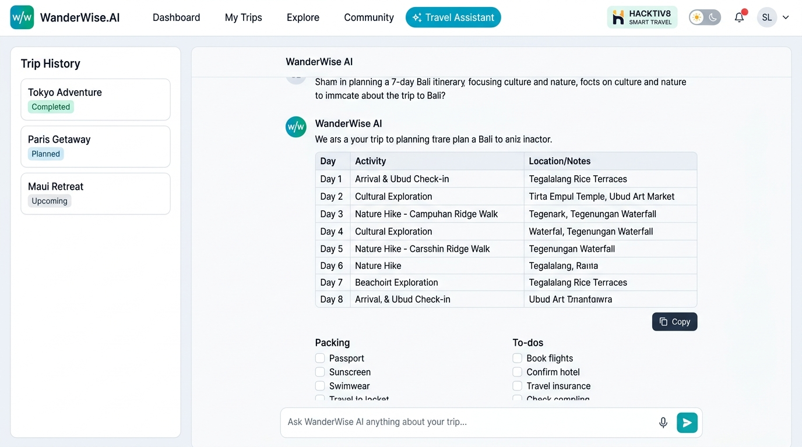

# ✈️ WanderWise AI - Smart Travel Assistant & Itinerary Planner

> **Hacktiv8 Final Project**  
> **Course**: *AI Productivity and AI API Integration for Developers*  
> **Topic**: AI Chatbot dengan Use Case Spesifik (Smart Travel Assistant), Konfigurasi Parameter Kreatif & Integrasi LLM API

---

## 📌 1. Gambaran Proyek (Project Overview)

**WanderWise AI** adalah aplikasi chatbot cerdas berbasis Artificial Intelligence (LLM) yang dirancang untuk mempermudah siapa pun merencanakan liburan impian secara personal, cepat, dan terperinci. Memanfaatkan kemampuan pemrosesan bahasa alami (*Natural Language Processing*), WanderWise AI mampu menyusun *day-by-day itinerary*, mengkalkulasi estimasi anggaran (*budget breakdown*) dalam mata uang Rupiah (IDR), merekomendasikan kuliner otentik, membagikan tips keselamatan alam bebas, hingga memberikan panduan etika budaya lokal.

Aplikasi ini mengintegrasikan **Google Gemini API** (`gemini-1.5-flash`, `gemini-1.5-pro`, `gemini-2.0-flash`) secara langsung dengan rekayasa prompt sistem (*system instruction*) yang dinamis. Aplikasi juga dilengkapi dengan **Interactive Demo Travel Engine (Mock Fallback)**, sehingga penilai atau instruktur Hacktiv8 dapat langsung menguji coba seluruh prompt tanpa kewajiban memiliki atau memasukkan API Key.

---

## 📸 2. Tangkapan Layar Antarmuka (UI Screenshots)

### Tampilan Utama - Dark Mode (Main Workspace & Travel Conversation)


### Tampilan Utama - Light Mode (Clean Daylight Resort Aesthetic)


### Panel Parameter Kreatif (Creative Travel Parameters Drawer)


---

## 🎯 3. Konfigurasi Parameter Kreatif (Creative Parameters)

Aplikasi ini memenuhi kriteria penugasan dengan menyediakan kontrol parameter kreatif dinamis yang langsung mengubah perilaku dan kepribadian model AI secara *real-time*:

| Parameter Kreatif | Opsi yang Disediakan | Dampak & Perilaku Model AI |
| :--- | :--- | :--- |
| **1. Domain & Gaya Wisata (Persona)** | 🎒 **Backpacker & Budget Hunter**<br>✨ **Luxury & Leisure Connoisseur**<br>🧗 **Adventure & Outdoor Explorer**<br>🏛️ **Culture, Heritage & Culinary Guide** | Mengubah fokus pengetahuan AI: gaya *Backpacker* memprioritaskan hostel, tiket promo, dan street food hemat; gaya *Luxury* berfokus pada resort bintang 5 dan fine dining; gaya *Adventure* fokus pada keselamatan trekking/diving; gaya *Culture* fokus pada sejarah dan kuliner legendaris. |
| **2. Gaya Bahasa (Tone Switcher)** | ☕ **Santai & Akrab** (Travel Buddy)<br>👔 **Formal & Concierge** (Standar Eksekutif)<br>⚡ **Ringkas & To-The-Point** (Fast Planner)<br>🗺️ **Storyteller & Insider** (Nuansa Naratif) | Mengatur gaya komunikasi bot: *Santai* menggunakan gaya santai komunitas traveler Indonesia; *Formal* layaknya pramutamu hotel bintang lima; *Ringkas* langsung ke poin tempat dan biaya tanpa basa-basi; *Storyteller* menggunakan deskripsi naratif puitis. |
| **3. Kreativitas Rute (Temperature)** | `0.0` s/d `1.0` (Interactive Slider) | Mengatur variasi generasi model: nilai rendah (`0.1 - 0.3`) menghasilkan rute logis dengan jadwal ketat; nilai tinggi (`0.7 - 1.0`) menghasilkan rekomendasi tempat *anti-mainstream* dan petualangan kreatif. |
| **4. Konteks Preferensi Trip (Memory Depth)** | `2`, `4`, `8`, `16` Pesan, atau `Full Memory` | Mengontrol *sliding window* memori percakapan agar AI tetap mengingat preferensi traveler sebelumnya (misal: "saya alergi seafood", "budget 3 juta", "rombongan bawa anak kecil") secara hemat token. |
| **5. Pilihan Model LLM** | **Gemini 3.5 Flash Lite** | Menggunakan model generasi terbaru dari Google AI yang ultra cepat, ringan, dan akurat. |
| **6. Tema Tampilan (Theme Switcher)** | 🌙 **Dark Mode** & ☀️ **Light Mode** | Memberikan kebebasan visual bagi pengguna untuk memilih mode malam bertema *Obsidian Night* atau mode siang bertema *Clean Daylight Luxury Resort*. |

---

## 🌟 4. Fitur-Fitur Unggulan (Key Features)

1. **Integrasi Google Gemini REST API Asli**:
   - Terkoneksi langsung ke endpoint Google Generative Language API (`v1beta`) dengan dukungan *systemInstruction*, penyesuaian *temperature*, dan *safety settings*.
   - Kunci API disimpan secara aman di `localStorage` peramban lokal klien.
2. **Interactive Demo Travel Engine (Mock Fallback)**:
   - Jika API key tidak diinput atau kuota API habis, sistem otomatis beralih ke engine simulasi cerdas dengan animasi pengetikan *streaming* dan contoh rute nyata (Bali 3D2N, Jogja Culinary, Jepang Solo Trip, Labuan Bajo Phinisi, Gunung Prau).
3. **Format Rencana Perjalanan Profesional**:
   - **Tabel Anggaran (Budget Table)**: Perhitungan estimasi biaya akomodasi, transportasi, makan, dan tiket masuk dalam IDR.
   - **Checklist Perlengkapan**: Panduan barang bawaan dan pakaian sesuai musim atau medan perjalanan.
   - **One-Click Copy Itinerary**: Salin rencana perjalanan lengkap dalam satu klik.
4. **Quick Travel Prompts**:
   - Kartu template prompt instan untuk skenario liburan populer:
     - 🌴 *Itinerary 3H2M di Bali (Budget 3 Juta)*
     - 🍜 *Wisata Kuliner Legendaris Yogyakarta*
     - 🍁 *Solo Trip Pertama ke Jepang (Musim Gugur)*
     - ⛵ *Sailing Trip 4H3M ke Labuan Bajo*
     - ⛰️ *Tips & Checklist Mendaki Gunung Prau*
     - 🚗 *Roadtrip Trans-Jawa ke Bali dengan Mobil Pribadi*
5. **Ekspor Berkas Itinerary**:
   - Unduh rencana perjalanan ke format **Markdown (`.md`)** atau **JSON** untuk dicetak atau disimpan di smartphone saat bepergian tanpa internet.
6. **Multi-Session Trip Management**:
   - Buat sesi rencana baru (`Ctrl+K`), ubah nama destinasi (*rename*), dan riwayat perjalanan tersimpan otomatis di peramban.
7. **Live Telemetry & Sound Effects**:
   - Indikator latensi AI (ms), estimasi token, serta efek suara lembut via Web Audio API synthesizer.

---

## 📁 5. Struktur Direktori Proyek (Client & Express REST API Architecture)

Sesuai silabus dan standar Hacktiv8, proyek ini menggunakan arsitektur modular dengan backend REST API Express dan SDK resmi `@google/genai`:

```
c:\Freelance\Hacktive8\
├── server/                              # Backend REST API Server
│   ├── node_modules/                    # Dependensi terinstal (express, @google/genai, dotenv, multer, cors)
│   ├── .env                             # File penyimpanan aman API Key (GEMINI_API_KEY=...)
│   ├── .env.example                     # Template variabel lingkungan
│   ├── package.json                     # Konfigurasi dependensi server (Express & @google/genai)
│   ├── package-lock.json                # Lockfile dependensi npm
│   └── index.js                         # REST API server Express dengan @google/genai SDK & Multer
├── css/
│   └── style.css                        # Desain kustom glassmorphism, Dark/Light mode, responsive layout
├── js/
│   ├── config.js                        # Konfigurasi persona wisata, tone, model & quick prompts
│   ├── audio.js                         # Web Audio API synthesizer efek suara perjalanan
│   ├── api.js                           # Client API yang memanggil Express REST API & Fallback Mock Engine
│   ├── chat.js                          # State manager multi-session perjalanan & ekspor berkas
│   └── app.js                           # UI Controller, drawer parameter, dan rendering streaming
├── screenshots/
│   ├── wanderwise_ui_main.jpg           # Screenshot tampilan utama Dark Mode
│   ├── wanderwise_ui_light.jpg          # Screenshot tampilan utama Light Mode
│   └── wanderwise_ui_params.jpg         # Screenshot panel pengaturan parameter kreatif
├── index.html                           # Antarmuka frontend semantik HTML5
├── package.json                         # Root launcher scripts (npm start, npm run dev)
├── README.md                            # Dokumentasi teknis komprehensif
├── .env.example                         # Template root env
└── .gitignore                           # Aturan ignore git (menjaga .env dan node_modules tetap aman)
```

---

## 🛠️ 6. Panduan Menjalankan Aplikasi (Getting Started)

### Persyaratan:
- **Node.js** (v18 ke atas disarankan)
- **NPM**

### Langkah Menjalankan:

#### 1. Setup Environment API Key di Server
Buka file `server/.env` dan masukkan Google Gemini API Key Anda:
```env
PORT=3000
GEMINI_API_KEY=AIzaSyYourGeminiApiKeyHere...
DEFAULT_MODEL=gemini-2.0-flash
```
*(Dapatkan API key gratis di [Google AI Studio](https://aistudio.google.com/app/apikey))*

#### 2. Jalankan Server Express
Bisa dijalankan langsung dari root direktori proyek:
```bash
# Dari root c:\Freelance\Hacktive8
npm start
```
Atau masuk ke folder `server`:
```bash
cd server
npm start
```

Server akan aktif di:
```
=======================================================
🚀 WanderWise AI Express Server berjalan!
📍 URL: http://localhost:3000
🔑 Gemini API Key: Terpasang
📦 Model Default: gemini-2.0-flash
=======================================================
```

#### 3. Buka di Peramban (Browser)
Akses alamat:
👉 **`http://localhost:3000`**

---

## 🔌 7. Spesifikasi Backend REST API (`server/index.js`)

REST API dibangun menggunakan **Express.js** dengan integrasi SDK generasi terbaru Google:

1. **`GET /api/health`**
   - Mengecek status server dan konfigurasi API key.
   - Response:
     ```json
     {
       "status": "online",
       "service": "WanderWise AI REST API (Express + @google/genai)",
       "hasApiKey": true,
       "defaultModel": "gemini-2.0-flash"
     }
     ```

2. **`POST /api/chat`**
   - Memproses obrolan itinerary via SDK `@google/genai` (`ai.models.generateContent`).
   - Request Body:
     ```json
     {
       "messages": [
         { "role": "user", "content": "Rekomendasi liburan 3H2M di Bali budget 3 juta" }
       ],
       "persona": "backpacker",
       "tone": "santai",
       "temperature": 0.7,
       "model": "gemini-2.0-flash"
     }
     ```
   - Response:
     ```json
     {
       "success": true,
       "text": "## 🌴 Itinerary 3 Hari 2 Malam: Eksplorasi Bali...",
       "model": "gemini-2.0-flash",
       "latencyMs": 850,
       "tokens": 420
     }
     ```

3. **`POST /api/upload`**
   - Menangani proses unggah berkas (gambar, audio, dokumen) menggunakan middleware **`multer`**.

---

## 📋 8. Check-list Deliverables Hacktiv8

- [x] **Chatbot Berbasis AI**: Memproses bahasa alami (NLP/LLM) untuk itinerary dan rekomendasi wisata relevan.
- [x] **Arsitektur Server Express**: Terstruktur dalam folder `server/` dengan `node_modules/`, `package.json`, dan `index.js`.
- [x] **File `.env`**: Menyimpan `GEMINI_API_KEY` secara aman menggunakan library `dotenv`.
- [x] **Google GenAI SDK**: Terhubung ke Gemini API menggunakan paket resmi `@google/genai`.
- [x] **Multer Upload Support**: Menangani upload gambar, audio, dan dokumen.
- [x] **Parameter Kreatif**:
  - [x] Domain & Gaya Wisatawan (Backpacker, Luxury, Adventure, Culture & Culinary).
  - [x] Gaya Bahasa / Tone (Santai akrab, Formal concierge, Ringkas to-the-point, Storyteller).
  - [x] Slider Tingkat Kreativitas Rute / Temperature (`0.0` s/d `1.0`).
  - [x] Context Memory Window selector.
  - [x] Pilihan Tema: Dark Mode (Obsidian) dan Light Mode (Clean Daylight).
- [x] **Fitur Ekspor & Penyimpanan**: Ekspor rencana perjalanan ke Markdown/JSON, multi-session local storage, live telemetry bar.
- [x] **Screenshots User Interface**: Tersedia di folder `screenshots/` dan terdokumentasi di `README.md`.
- [x] **Repositori GitHub**: Siap dipublikasikan dengan `.gitignore` rapi dan aman.

---

**Dibuat untuk Final Project Hacktiv8: AI Productivity and AI API Integration for Developers**
