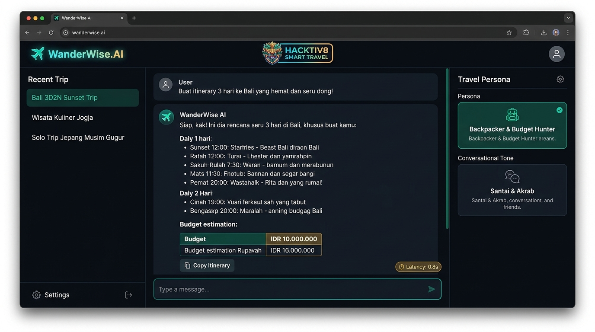
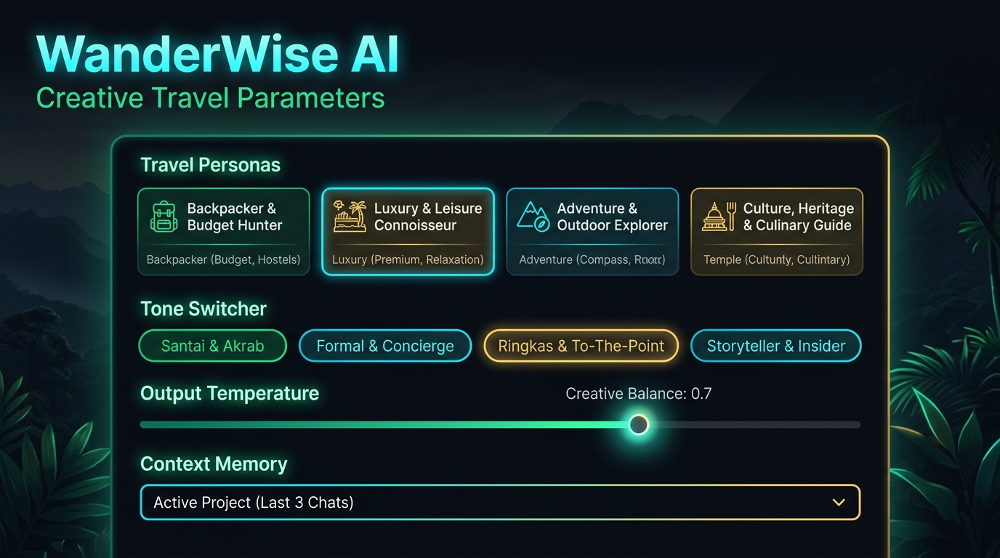

# ✈️ WanderWise AI - Smart Travel Assistant & Itinerary Planner

> **Hacktiv8 Final Project**  
> **Course**: *AI Productivity and AI API Integration for Developers*  
> **Topic**: AI Chatbot dengan Use Case Spesifik (Smart Travel Assistant), Konfigurasi Parameter Kreatif & Integrasi LLM API

---

## 📌 1. Gambaran Proyek (Project Overview)

**WanderWise AI** adalah aplikasi chatbot cerdas berbasis Artificial Intelligence (LLM) yang dirancang untuk mempermudah siapa pun merencanakan liburan impian secara personal, cepat, dan terperinci. Memanfaatkan kemampuan pemrosesan bahasa alami (*Natural Language Processing*), WanderWise AI mampu menyusun *day-by-day itinerary*, mengkalkulasi estimasi anggaran (*budget breakdown*) dalam mata uang Rupiah (IDR), merekomendasikan kuliner otentik, membagikan tips keselamatan alam bebas, hingga memberikan panduan etika budaya lokal.

Aplikasi ini mengintegrasikan **Google Gemini API** (`gemini-1.5-flash`, `gemini-1.5-pro`, `gemini-2.0-flash`) secara langsung dengan rekayasa prompt sistem (*system instruction*) yang dinamis. Aplikasi juga dilengkapi dengan **Interactive Demo Travel Engine (Mock Fallback)**, sehingga penilai atau instruktur Hacktiv8 dapat langsung menguji coba seluruh prompt tanpa kewajiban memiliki atau memasukkan API Key.

---

## 📸 2. Tangkapan Layar Antarmuka (UI Screenshots)

### Tampilan Utama (Main Workspace & Travel Conversation)


### Panel Parameter Kreatif (Creative Travel Parameters Drawer)


---

## 🎯 3. Konfigurasi Parameter Kreatif (Creative Parameters)

Aplikasi ini memenuhi kriteria penugasan dengan menyediakan kontrol parameter kreatif dinamis yang langsung mengubah perilaku dan kepribadian model AI secara *real-time*:

| Parameter Kreatif | Opsi yang Disediakan | Dampak & Perilaku Model AI |
| :--- | :--- | :--- |
| **1. Domain & Gaya Wisata (Persona)** | 🎒 **Backpacker & Budget Hunter**<br>✨ **Luxury & Leisure Connoisseur**<br>🧗 **Adventure & Outdoor Explorer**<br>🏛️ **Culture, Heritage & Culinary Guide** | Mengubah fokus pengetahuan AI: gaya *Backpacker* memprioritaskan hostel, tiket promo, dan street food hemat; gaya *Luxury* berfokus pada resort bintang 5 dan fine dining; gaya *Adventure* fokus pada keselamatan trekking/diving; gaya *Culture* fokus pada sejarah dan kuliner legendaris. |
| **2. Gaya Bahasa (Tone Switcher)** | ☕ **Santai & Akrab** (Travel Buddy)<br>👔 **Formal & Concierge** (Standar Eksekutif)<br>⚡ **Ringkas & To-The-Point** (Fast Planner)<br>🗺️ **Storyteller & Insider** (Nuansa Naratif) | Mengatur gaya komunikasi bot: *Santai* menggunakan gaya santai komunitas traveler Indonesia; *Formal* layaknya pramutamu hotel bintang lima; *Ringkas* langsung ke poin tempat dan biaya tanpa basa-basi; *Storyteller* menggunakan deskripsi naratif puitis. |
| **3. Kreativitas Rute (Temperature)** | `0.0` s/d `1.0` (Interactive Slider) | Mengatur variasi generasi model: nilai rendah (`0.1 - 0.3`) menghasilkan rute logis dengan jadwal ketat; nilai tinggi (`0.7 - 1.0`) menghasilkan rekomendasi tempat *anti-mainstream* dan petualangan kreatif. |
| **4. Konteks Preferensi Trip (Memory Depth)** | `2`, `4`, `8`, `16` Pesan, atau `Full Memory` | Mengontrol *sliding window* memori percakapan agar AI tetap mengingat preferensi traveler sebelumnya (misal: "saya alergi seafood", "budget 3 juta", "rombongan bawa anak kecil") secara hemat token. |
| **5. Pilihan Model LLM** | `gemini-1.5-flash`, `gemini-1.5-pro`, `gemini-2.0-flash`, `mock-demo` | Fleksibilitas memilih engine AI sesuai kebutuhan kecepatan vs kompleksitas penalaran rute multi-kota. |

---

## 🌟 4. Fitur-Fitur Unggulan (Key Features)

1. **Integrasi Google Gemini REST API Asli**:
   - Terkoneksi langsung ke endpoint Google Generative Language API (`v1beta`) dengan dukungan *systemInstruction*, penyesuaian *temperature*, dan *safety settings*.
   - Kunci API disimpan secara aman di `localStorage` peramban lokal klien.
2. **Interactive Demo Travel Engine (Mock Fallback)**:
   - Jika API key tidak diinput atau kuota API habis, sistem otomatis beralih ke engine simulasi cerdas dengan animasi pengetikan *streaming* dan contoh rute nyata (Bali 3D2N, Jogja Culinary, Jepang Solo Trip, Labuan Bajo Phinisi, Gunung Prau).
3. **Format Rencana Perjalanan Profesional**:
   - **Tabel Anggaran (Budget Table)**: Perhitungan estimasi biaya akomodasi, transportasi, makan, dan tiket masuk dalam IDR.
   - **Checklist Perlengkapan**: Panduan barang bawaan dan pakaian sesuai musim atau medan perjalanan.
   - **One-Click Copy Itinerary**: Salin rencana perjalanan lengkap dalam satu klik.
4. **Quick Travel Prompts**:
   - Kartu template prompt instan untuk skenario liburan populer:
     - 🌴 *Itinerary 3H2M di Bali (Budget 3 Juta)*
     - 🍜 *Wisata Kuliner Legendaris Yogyakarta*
     - 🍁 *Solo Trip Pertama ke Jepang (Musim Gugur)*
     - ⛵ *Sailing Trip 4H3M ke Labuan Bajo*
     - ⛰️ *Tips & Checklist Mendaki Gunung Prau*
     - 🚗 *Roadtrip Trans-Jawa ke Bali dengan Mobil Pribadi*
5. **Ekspor Berkas Itinerary**:
   - Unduh rencana perjalanan ke format **Markdown (`.md`)** atau **JSON** untuk dicetak atau disimpan di smartphone saat bepergian tanpa internet.
6. **Multi-Session Trip Management**:
   - Buat sesi rencana baru (`Ctrl+K`), ubah nama destinasi (*rename*), dan riwayat perjalanan tersimpan otomatis di peramban.
7. **Live Telemetry & Sound Effects**:
   - Indikator latensi AI (ms), estimasi token, serta efek suara lembut via Web Audio API synthesizer.

---

## 📁 5. Struktur Direktori Proyek

```
c:\Freelance\Hacktive8\
├── index.html               # Struktur antarmuka semantik HTML5 dengan drawer parameter
├── package.json             # Konfigurasi npm script untuk local development
├── README.md                # Dokumentasi komprehensif untuk pengumpulan tugas
├── .env.example             # Template variabel lingkungan untuk API key
├── .gitignore               # Aturan ignore git
├── css/
│   └── style.css            # Desain kustom glassmorphism, travel theme, table & responsive layout
├── js/
│   ├── config.js            # Konfigurasi gaya wisata, tone, quick prompts & system prompt builder
│   ├── audio.js             # Web Audio API synthesizer efek suara
│   ├── api.js               # Service integrasi Gemini REST API & Travel Mock Engine
│   ├── chat.js              # State manager sesi perjalanan & fungsi ekspor berkas
│   └── app.js               # Event controller penghubung UI, slider, dan streaming text
└── screenshots/
    ├── wanderwise_ui_main.jpg   # Screenshot tampilan utama percakapan itinerary
    └── wanderwise_ui_params.jpg # Screenshot panel pengaturan parameter kreatif
```

---

## 🛠️ 6. Panduan Menjalankan Aplikasi (Getting Started)

Aplikasi dibangun menggunakan teknologi web standar (Vanilla HTML5, CSS3, dan Modern JavaScript ES6+) sehingga sangat ringan dan dapat dijalankan tanpa kompilasi build tools yang rumit.

### Cara 1: Menggunakan NPM (Direkomendasikan)
```bash
# 1. Buka terminal di direktori proyek
cd Hacktive8

# 2. Jalankan server lokal
npm start
# atau
npm run dev

# 3. Buka browser di alamat:
http://localhost:3000
```

### Cara 2: Menggunakan Python Server
```bash
python -m http.server 3000
# Buka http://localhost:3000 pada peramban
```

### Cara 3: Langsung Buka File HTML (Standalone)
Cukup klik ganda (*double click*) file `index.html` pada File Explorer Anda untuk langsung menjalankan aplikasi secara lokal di peramban apa pun!

---

## 🔑 7. Konfigurasi API Key (Opsional)

1. Buka aplikasi di peramban.
2. Klik tombol **API Key** di pojok kanan atas.
3. Masukkan Google Gemini API Key Anda (dapatkan gratis di [Google AI Studio](https://aistudio.google.com/app/apikey)).
4. Klik **Simpan Pengaturan**.
> *Catatan: Jika Anda tidak memiliki API Key, Anda tetap dapat mencoba seluruh prompt dan fitur melalui **Interactive Demo Travel Engine** bawaan.*

---

## 📋 8. Check-list Deliverables Hacktiv8

- [x] **Chatbot Berbasis AI**: Memproses bahasa alami (NLP/LLM) untuk memberikan respon itinerary dan rekomendasi wisata yang relevan.
- [x] **Use Case Kreatif**: **Smart Travel Assistant** (*WanderWise AI*).
- [x] **Parameter Kreatif**:
  - [x] Domain & Gaya Wisatawan (Backpacker, Luxury, Adventure, Culture & Culinary).
  - [x] Gaya Bahasa / Tone (Santai akrab, Formal concierge, Ringkas to-the-point, Storyteller).
  - [x] Slider Tingkat Kreativitas Rute / Temperature (`0.0` s/d `1.0`).
  - [x] Context Memory Window selector.
- [x] **Integrasi AI API**: Google Gemini REST API v1beta + Smart Interactive Mock Fallback.
- [x] **Fitur Tambahan**: Ekspor rencana perjalanan ke Markdown/JSON, multi-session local storage, tabel estimasi budget, code/itinerary copy button, quick prompts.
- [x] **Screenshots User Interface**: Tersedia di folder `screenshots/` dan terdokumentasi di `README.md`.
- [x] **Repositori GitHub**: Siap dipublikasikan dengan struktur bersih dan `.gitignore`.

---

**Dibuat untuk Final Project Hacktiv8: AI Productivity and AI API Integration for Developers**
