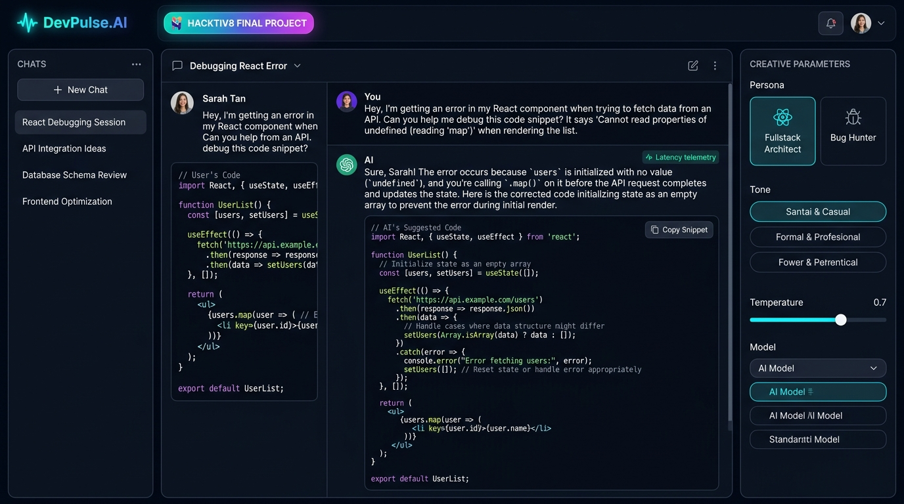
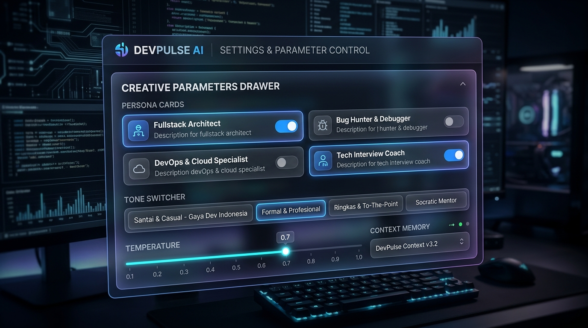

# ⚡ DevPulse AI - Developer Productivity & Code Intelligence Assistant

> **Hacktiv8 Final Project**  
> **Course**: *AI Productivity and AI API Integration for Developers*  
> **Topic**: AI Chatbot dengan Konfigurasi Parameter Kreatif & Integrasi LLM API

---

## 📌 1. Gambaran Proyek (Project Overview)

**DevPulse AI** adalah aplikasi chatbot berbasis Artificial Intelligence (LLM) yang dirancang khusus untuk meningkatkan produktivitas software engineer, technical lead, dan developer harian. Aplikasi ini memproses bahasa alami (*Natural Language Processing*) untuk menganalisis kode, mendiagnosis pesan error *stack trace*, merancang arsitektur sistem backend/frontend, serta mempersiapkan wawancara teknis (*technical interview*).

Aplikasi ini mengintegrasikan **Google Gemini API** (`gemini-1.5-flash`, `gemini-1.5-pro`, `gemini-2.0-flash`) serta dilengkapi dengan **Interactive Demo Engine (Mock Fallback)** sehingga penilai atau pengguna dapat langsung menguji coba seluruh fungsionalitas tanpa kewajiban menginput API Key.

---

## 📸 2. Tangkapan Layar Antarmuka (UI Screenshots)

### Tampilan Utama (Main Workspace & Chat Experience)


### Panel Parameter Kreatif & Konfigurasi (Creative Parameters Drawer)


---

## 🎯 3. Konfigurasi Parameter Kreatif (Creative Parameters)

Proyek ini mengimplementasikan parameter kreatif dinamis yang langsung mengubah prompt rekayasa sistem (*system instruction*) dan perilaku model AI:

| Parameter | Opsi / Rentang | Penjelasan & Dampak ke AI |
| :--- | :--- | :--- |
| **Domain & Persona** | 🛠️ **Fullstack Architect**<br>🐞 **Bug Hunter & Debugger**<br>🚀 **DevOps & Cloud Specialist**<br>💼 **Tech Interview Coach** | Mengubah fokus domain pengetahuan sistem prompt AI agar jawaban spesifik pada arsitektur, *root-cause analysis*, infrastruktur container, atau simulasi wawancara kerja. |
| **Gaya Bahasa (Tone)** | ☕ **Santai & Casual** (Gaya Dev Indonesia)<br>👔 **Formal & Profesional** (Standar Korporat)<br>⚡ **Ringkas & To-The-Point** (Ultra Fast)<br>🎓 **Socratic Mentor** (Tanya-Jawab Terpandu) | Mengubah gaya komunikasi bot. Opsi *Santai* menggunakan bahasa akrab komunitas tech lokal, sedangkan *Socratic Mentor* membimbing dengan pertanyaan refleksi tanpa langsung membocorkan jawaban utuh. |
| **Temperature** | `0.0` s/d `1.0` (Slider Interaktif) | Mengatur tingkat kreativitas vs determinisme model AI. Nilai rendah (`0.1 - 0.3`) untuk kode deterministik dan debugging; nilai tinggi (`0.7 - 1.0`) untuk *brainstorming* fitur dan arsitektur. |
| **Context Memory Depth** | `2`, `4`, `8`, `16` Pesan, atau `Full Memory` | Mengontrol *sliding window* riwayat pesan yang dikirimkan ke payload API untuk menjaga konteks percakapan multi-turn secara hemat token. |
| **Pilihan Model LLM** | `gemini-1.5-flash`, `gemini-1.5-pro`, `gemini-2.0-flash`, `mock-demo` | Fleksibilitas memilih engine AI sesuai kebutuhan kecepatan vs kompleksitas penalaran. |

---

## 🚀 4. Fitur-Fitur Unggulan (Key Features)

1. **Integrasi Google Gemini API Asli**:
   - Terkoneksi ke endpoint `https://generativelanguage.googleapis.com/v1beta/models/` dengan dukungan *systemInstruction* dan *generationConfig*.
   - Input API key aman yang disimpan pada `localStorage` browser klien (tidak dikirim ke server pihak ketiga).
2. **Interactive Demo Engine (Mock Fallback)**:
   - Jika API key tidak diisi atau kuota API habis, sistem secara mulus (*graceful fallback*) beralih ke engine simulasi pintar dengan pengetikan *real-time streaming*.
3. **Developer Productivity Suite**:
   - **Syntax Highlighting**: Penyorotan sintaks kode multi-bahasa (JavaScript, Python, Dockerfile, SQL, Bash) menggunakan *Highlight.js* dengan tema modern.
   - **One-Click Copy Snippet**: Tombol salin kode satu-klik dengan indikator status sukses.
   - **Quick Prompt Templates**: Tombol *shortcut* cepat untuk skenario umum (Bedah Stack Trace, Optimasi Query N+1, Docker Multi-stage, JWT Auth, System Design).
   - **Live Telemetry Tracker**: Indikator *real-time* untuk latensi respon (ms) dan estimasi token yang digunakan.
4. **Manajemen Sesi Obrolan (Multi-Session Chat)**:
   - Membuat obrolan baru (`Ctrl+K`), mengganti nama sesi (*rename*), menghapus sesi, dan penyimpanan otomatis di `localStorage`.
5. **Ekspor Percakapan**:
   - Ekspor percakapan lengkap ke format **Markdown (`.md`)** atau **JSON** untuk dokumentasi tim.
6. **Web Audio Synthesizer**:
   - Efek suara futuristik lembut untuk pesan terkirim, balasan diterima, dan aksi pengguna tanpa file audio eksternal.

---

## 📁 5. Struktur Direktori Proyek

```
c:\Freelance\Hacktive8\
├── index.html               # Struktur antarmuka semantik HTML5 & modal pengaturan
├── package.json             # Konfigurasi npm script untuk local development server
├── .env.example             # Template variabel lingkungan untuk API key
├── .gitignore               # Daftar pengecualian file sistem & kredensial
├── css/
│   └── style.css            # Desain kustom glassmorphism, obsidian dark theme & responsive layout
├── js/
│   ├── config.js            # Definisi persona, tone, template quick prompt & system instructions
│   ├── audio.js             # Web Audio API synthesizer untuk micro-interactions suara
│   ├── api.js               # Service integrasi Gemini REST API & Interactive Mock Engine
│   ├── chat.js              # State manager sesi, riwayat percakapan & ekspor markdown/json
│   └── app.js               # Event controller penghubung UI, slider, dan streaming text
└── screenshots/
    ├── devpulse_ui_main.jpg   # Screenshot tampilan utama obrolan dan fitur
    └── devpulse_ui_params.jpg # Screenshot panel parameter kreatif dan konfigurasi
```

---

## 🛠️ 6. Panduan Menjalankan Aplikasi (Getting Started)

Aplikasi dibangun menggunakan teknologi web standar (Vanilla HTML5, CSS3, dan Modern JavaScript ES6+) sehingga sangat ringan dan dapat dijalankan tanpa dependensi build tools yang rumit.

### Cara 1: Menggunakan Node.js / NPM (Direkomendasikan)
```bash
# 1. Masuk ke direktori proyek
cd Hacktive8

# 2. Jalankan server lokal
npm start
# atau
npm run dev

# 3. Buka browser di alamat:
http://localhost:3000
```

### Cara 2: Menggunakan Python Built-in Server
```bash
python -m http.server 3000
# Buka http://localhost:3000 pada browser
```

### Cara 3: Langsung Buka di Browser (Standalone)
Cukup klik ganda (*double click*) file `index.html` pada File Explorer Anda untuk langsung menjalankan aplikasi secara lokal!

---

## 🔑 7. Konfigurasi API Key (Opsional)

1. Buka aplikasi di browser.
2. Klik tombol **API Key** di pojok kanan atas.
3. Masukkan Google Gemini API Key Anda (dapat diperoleh secara gratis di [Google AI Studio](https://aistudio.google.com/app/apikey)).
4. Klik **Simpan Pengaturan**.
> *Catatan: Jika Anda tidak memiliki API Key, Anda tetap dapat mencoba seluruh prompt dan fitur melalui **Interactive Demo Engine (Mock)** bawaan.*

---

## 📋 8. Check-list Deliverables Hacktiv8

- [x] **Chatbot Berbasis AI**: Memproses bahasa alami dan memberikan respon teknis terstruktur dengan model LLM.
- [x] **Use Case Kreatif**: *Developer Productivity & Code Intelligence Assistant* (selaras dengan judul kursus *AI Productivity and AI API Integration for Developers*).
- [x] **Parameter Kreatif**:
  - [x] Domain & Persona Switcher (Fullstack Architect, Bug Hunter, DevOps Specialist, Interview Coach).
  - [x] Tone / Gaya Bahasa Switcher (Santai gaya dev Indonesia, Formal profesional, Ringkas to-the-point, Socratic mentor).
  - [x] Slider Kreativitas / Temperature (`0.0` s/d `1.0`).
  - [x] Context Memory Window selector.
- [x] **Integrasi AI API Eksternal**: Google Gemini API REST v1beta + Smart Interactive Mock Fallback.
- [x] **Fitur Tambahan**: Ekspor percakapan Markdown/JSON, multi-session local storage, live telemetry token/ms, code snippet copy button, quick prompts.
- [x] **Screenshots UI**: Tersedia di folder `screenshots/` dan terdokumentasi di `README.md`.
- [x] **Repositori GitHub**: Siap dipublikasikan dengan struktur bersih dan `.gitignore`.

---

**Dibuat untuk Final Project Hacktiv8: AI Productivity and AI API Integration for Developers**
